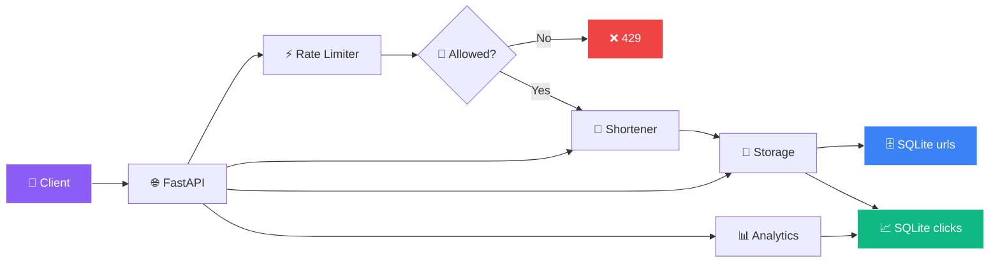
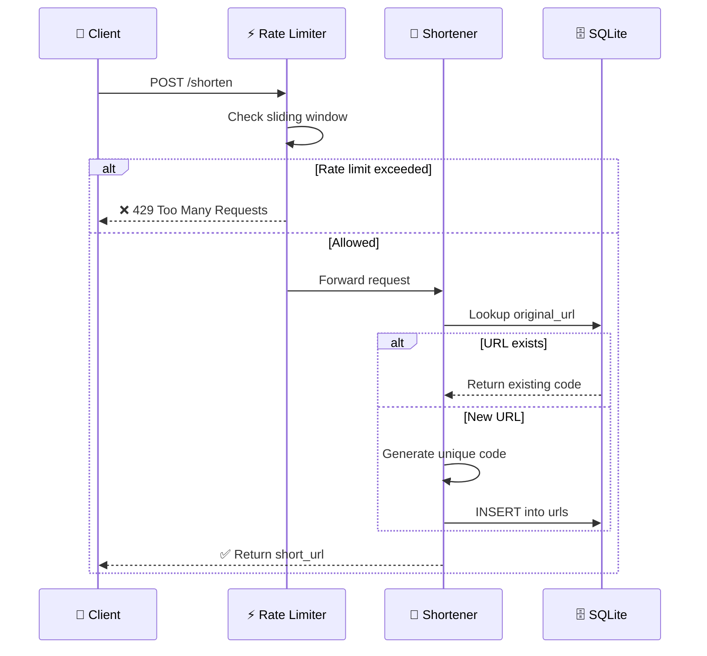
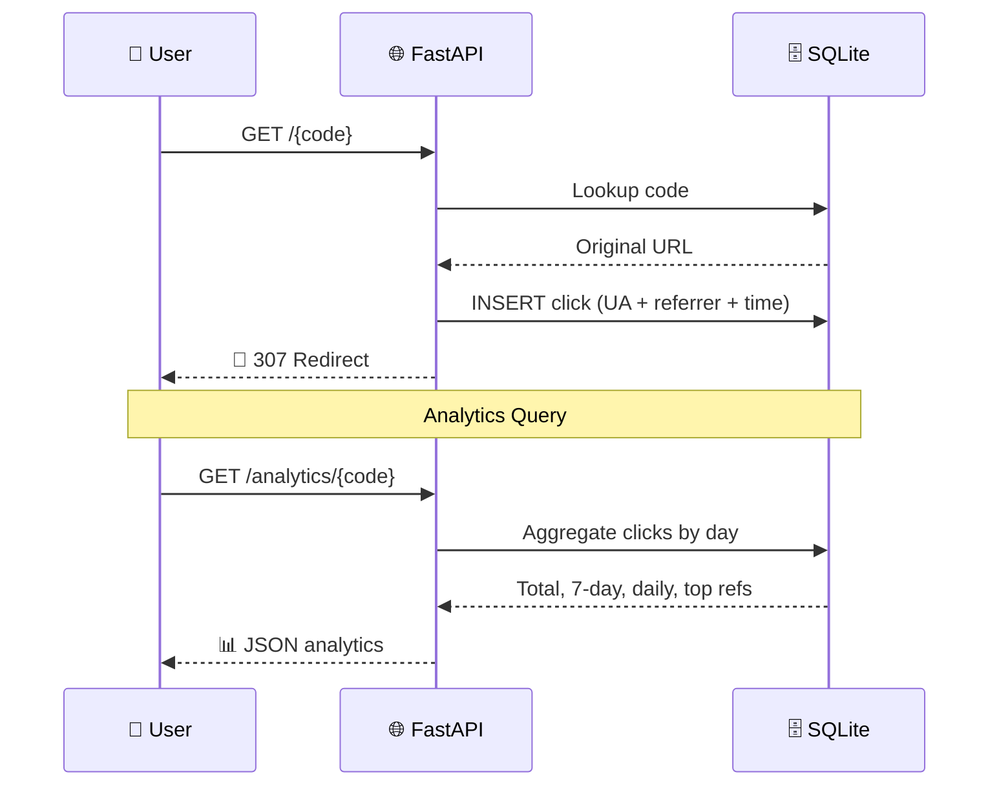
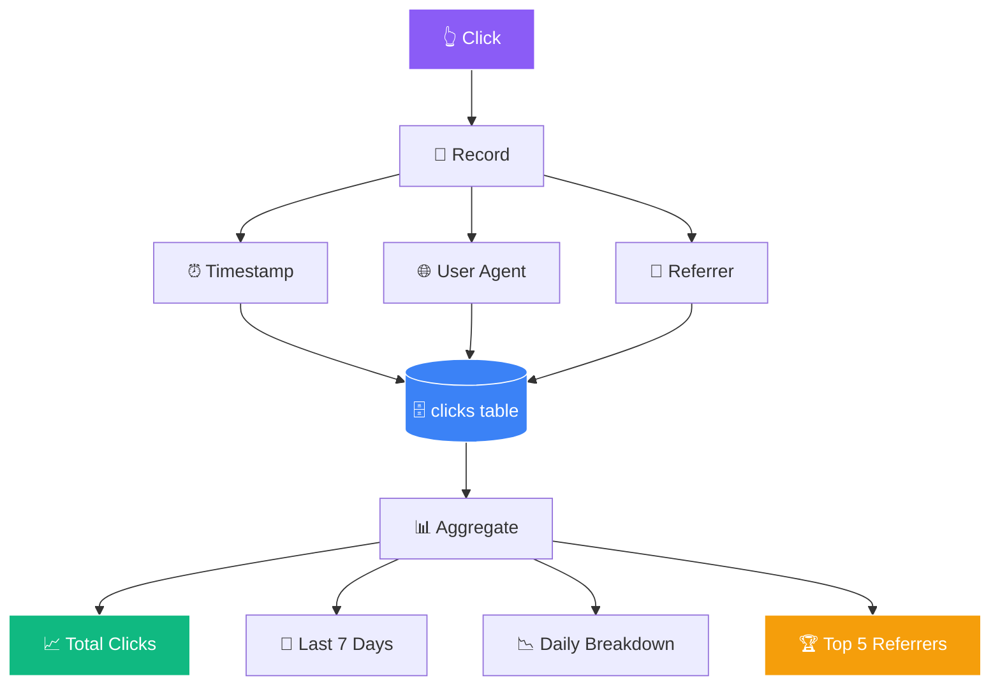
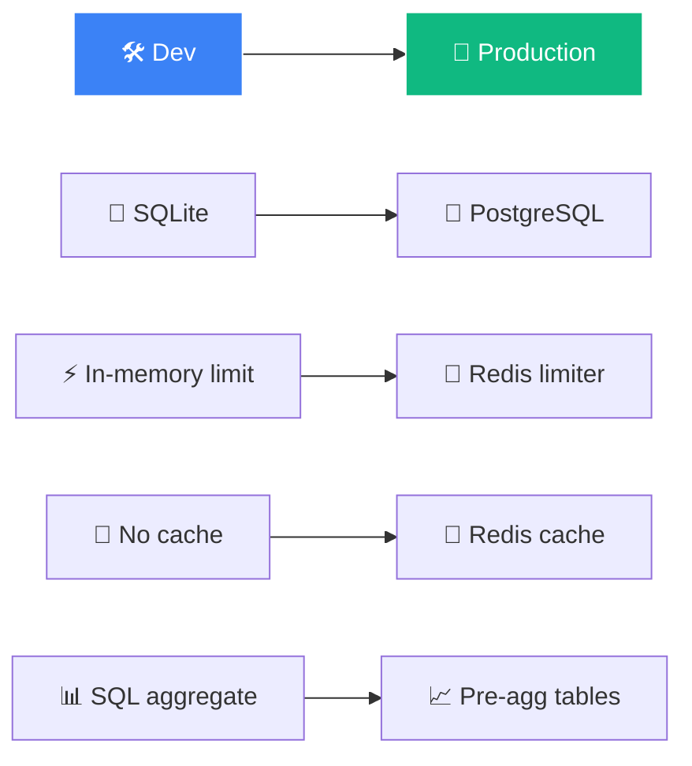

<!-- ═══════════════════════════════════════════════════════════════ -->
<!-- 🔗 Scalable URL Shortener — Full Animated README -->
<!-- ═══════════════════════════════════════════════════════════════ -->

<div align="center">


</div>

<div align="center">
  
</div>

<br/>

<div align="center">
  <a href="https://github.com/sumit966/url-shortener-service/stargazers">
    
  </a>
  <a href="https://github.com/sumit966/url-shortener-service/network/members">
    
  </a>
  <a href="https://github.com/sumit966/url-shortener-service/issues">
    
  </a>
  <a href="https://github.com/sumit966/url-shortener-service/commits/main">
    
  </a>
</div>

<br/>

<div align="center">
  
  
  
  
  
  
</div>

<br/>

<div align="center">
  
  
  
  
</div>

<br/>

<div align="center">
  <i>⚙️ Backend Engineering Project · Author: <b>Sumit Raj</b> · M.Tech VNIT Nagpur</i>
</div>

<br/>


---

## 📑 Table of Contents

<div align="center">

| 🔗 | 🎯 | 🏗️ |
|:---:|:---:|:---:|
| [Overview](#-overview) | [Problem](#-problem-statement) | [Solution](#-solution) |
| [Architecture](#-architecture) | [Tech Stack](#-tech-stack) | [Structure](#-project-structure) |
| [Quick Start](#-quick-start) | [API Usage](#-api-usage) | [Rate Limiting](#-rate-limiting) |
| [Analytics](#-analytics-details) | [Testing](#-testing) | [Docker](#-docker) |
| [Production Path](#-production-upgrade-path) | [Learnings](#-key-learnings) | [Future](#-future-improvements) |

</div>

---

## 🎯 Overview

<div align="center">
  
</div>

<br/>

A URL shortener that goes beyond naive **"hash and store"**:

<table align="center">
<tr>
<td width="33%" valign="top" align="center">

### 🔄 Idempotent


Same URL returns the same short code

</td>
<td width="33%" valign="top" align="center">

### 🎨 Custom Codes


Users can pick their own alias

</td>
<td width="33%" valign="top" align="center">

### 🛡️ Collision-Safe


Retries on collision, huge keyspace

</td>
</tr>
<tr>
<td width="33%" valign="top" align="center">

### ⚡ Rate Limiting


Sliding window per IP

</td>
<td width="33%" valign="top" align="center">

### 📊 Click Tracking


User agent, referrer, timestamp

</td>
<td width="33%" valign="top" align="center">

### 📈 Analytics


Total clicks, 7-day, top referrers

</td>
</tr>
</table>

<br/>

<div align="center">

### 🔐 Admin Delete


</div>

---

## 🎯 Problem Statement

<div align="center">
  
</div>

<br/>

<table align="center">
<tr>
<td width="50%" valign="top">

### ⚠️ Real Challenges

- 📦 **Duplicate storage** — same URL twice → two codes
- 💥 **Collisions** — random codes can collide
- 🚨 **Abuse** — bots can flood without rate limits
- 📊 **Analytics** — clicks alone aren't enough
- ✏️ **Custom codes** — must validate & check uniqueness

</td>
<td width="50%" valign="top">

### ✅ Our Approach

- ♻️ **Idempotency** via reverse lookup on URL
- 🔐 **Bounded retry loop** on collisions
- ⚡ **Sliding-window rate limiter** per IP
- 📈 **Time-series + referrer** analytics
- 🎨 **Custom code validation** with uniqueness check

</td>
</tr>
</table>

---

## ✨ Solution

A FastAPI service with:



<br/>

<table align="center">
<tr>
<td width="50%" valign="top">

### 🔗 Endpoints

- 🔵 `POST /shorten` — idempotent, custom code
- 🟢 `GET /{code}` — 307 redirect + click record
- 🟠 `GET /analytics/{code}` — full analytics
- 🟣 `GET /urls?limit=100` — list recent URLs
- 🔴 `DELETE /urls/{code}` — admin (header token)

</td>
<td width="50%" valign="top">

### 🛠️ Features

- ⚡ **Sliding-window rate limiter** per IP
- 🔐 **Admin delete** with header token
- 🗄️ **SQLite schema** with indexed clicks
- 🔄 **Collision-safe** retry loop
- ♻️ **Idempotent** on duplicate URLs

</td>
</tr>
</table>

---

## 🏗️ Architecture

### 🌐 Request Flow



### 📊 Redirect + Analytics Flow



### 📐 ASCII Fallback

```
Client
  |
  |-- POST /shorten --> Rate Limiter --> Idempotency Check
  |                                          |
  |                                          v
  |                                     Generate Code
  |                                          |
  |                                          v
  |                                     SQLite (urls)
  |                                          |
  |-- GET /{code} --> Lookup --> Record Click --> 307 Redirect
  |                     |
  |                     v
  |                SQLite (clicks)
  |
  |-- GET /analytics/{code} --> Aggregate queries --> JSON
```

---

## 🛠️ Tech Stack

<table align="center">
<tr>
<td><b>Category</b></td>
<td><b>Technologies</b></td>
</tr>
<tr>
<td>🌐 API</td>
<td>
  
  
  
</td>
</tr>
<tr>
<td>💾 Storage</td>
<td></td>
</tr>
<tr>
<td>⚡ Rate Limiting</td>
<td></td>
</tr>
<tr>
<td>🧪 Testing</td>
<td>
  
  
</td>
</tr>
<tr>
<td>🚀 Optional Upgrade</td>
<td>
  
  
</td>
</tr>
<tr>
<td>🐳 Containerization</td>
<td></td>
</tr>
<tr>
<td>⚙️ CI/CD</td>
<td></td>
</tr>
<tr>
<td>🐍 Language</td>
<td></td>
</tr>
</table>

---

## 📁 Project Structure

```
url-shortener-service/
├── 🐍 src/
│   ├── __init__.py
│   ├── 🔗 shortener.py        # Code generation + validation
│   ├── 💾 storage.py          # SQLite schema + CRUD + analytics
│   └── ⚡ ratelimit.py        # Sliding-window limiter
├── 🌐 api/
│   ├── __init__.py
│   └── main.py                # FastAPI endpoints
├── 🧪 tests/
│   ├── __init__.py
│   └── test_api.py            # pytest tests
├── 📊 data/                   # SQLite db (git-ignored)
├── ⚙️ .github/workflows/ci.yml
├── 🐳 Dockerfile
├── 📋 requirements.txt
├── 📋 requirements-optional.txt
├── 🔐 .env.example
├── 🚫 .gitignore
├── 📜 LICENSE
└── 📖 README.md
```

---

## 🚀 Quick Start

<div align="center">
  
  
</div>

<br/>

### 1️⃣ Clone

```bash
git clone https://github.com/sumit966/url-shortener-service.git
cd url-shortener-service
```

### 2️⃣ Virtual Environment

**Windows:**

```bash
python -m venv venv
venv\Scripts\activate
```

**macOS / Linux:**

```bash
python3 -m venv venv
source venv/bin/activate
```

### 3️⃣ Install Dependencies

```bash
pip install -r requirements.txt
```

### 4️⃣ Start the API

```bash
uvicorn api.main:app --reload
```

**Runs at:** http://localhost:8000

### 5️⃣ Open Swagger

```bash
http://localhost:8000/docs
```

---

## 🎮 API Usage

### 🔵 POST `/shorten`

**Request:**

```json
{
  "url": "https://example.com/some/long/path",
  "custom_code": "myalias"
}
```

**Response:**

```json
{
  "code": "myalias",
  "short_url": "http://localhost:8000/myalias",
  "original_url": "https://example.com/some/long/path",
  "created_at": "2025-01-15T10:30:00"
}
```

> 💡 **Idempotent:** sending the same URL again returns the same code.

### 🟢 GET `/{code}`

Redirects **(307)** to the original URL and records a click with **user agent + referrer**.

### 🟠 GET `/analytics/{code}`

**Response:**

```json
{
  "code": "myalias",
  "original_url": "https://example.com/some/long/path",
  "total_clicks": 42,
  "clicks_last_7_days": 18,
  "daily_breakdown": [
    {"day": "2025-01-09", "c": 3},
    {"day": "2025-01-10", "c": 5}
  ],
  "top_referrers": [
    {"referrer": "https://twitter.com", "c": 8}
  ],
  "created_at": "2025-01-15T10:30:00"
}
```

### 🟣 GET `/urls?limit=100`

List the most recent URLs with click counts.

### 🔴 DELETE `/urls/{code}`

Delete a URL and its click history. Requires admin header.

```bash
curl -X DELETE http://localhost:8000/urls/myalias -H "X-Admin: admin-secret"
```

### 📋 Other Endpoints

| Endpoint | Method | Purpose |
|----------|:------:|---------|
| 🔵 `/` | 🟢 GET | API info |
| 💚 `/health` | 🟢 GET | Health check |
| 📘 `/docs` | 🟢 GET | Swagger UI |
| 📗 `/redoc` | 🟢 GET | Alternative docs |

---

## ⚡ Rate Limiting

<div align="center">
  
</div>

<br/>

<table align="center">
<tr>
<td width="50%" valign="top">

### 🛡️ Rules

- ⏱️ **Sliding window:** 60 requests / 60 seconds
- 🌐 **Per client IP**
- 🎯 **Applied to:** `POST /shorten`
- ❌ **Returns 429** when exceeded

</td>
<td width="50%" valign="top">

### 💡 Why Sliding Window?

- ✅ **More accurate** than fixed window
- ✅ **No burst** at window boundaries
- ✅ **Fair** distribution over time
- ✅ **Simple** to implement in-memory

</td>
</tr>
</table>

---

## 📊 Analytics Details

<div align="center">
  
</div>

<br/>



<br/>

Every redirect records **timestamp, user-agent, and referer**. Aggregated queries return:

- 📈 **Total clicks**
- 📅 **Clicks in the last 7 days**
- 📉 **Day-by-day breakdown**
- 🏆 **Top 5 referrers**

> 💡 The `clicks` table is **indexed on `code` and `clicked_at`** for fast aggregation.

---

## 🧪 Testing

```bash
pytest tests/ -v
```

**Tests cover:**

- ✅ Root
- 💚 Health
- 🔵 Shorten valid
- ❌ Invalid URL returns 400
- ♻️ Idempotent shorten
- 🎨 Custom code
- 🔄 Redirect 307
- 📊 Analytics

---

## 🐳 Docker

### 🔨 Build

```bash
docker build -t url-shortener .
```

### ▶️ Run

```bash
docker run -p 8000:8000 url-shortener
```

---

## 📈 Production Upgrade Path



| Component | Dev | Production |
|-----------|-----|------------|
| 💾 Storage | SQLite | **PostgreSQL** |
| ⚡ Rate limit | In-memory | **Redis** |
| 🚀 Cache | None | **Redis (redirect cache)** |
| 📊 Analytics | SQL aggregate | **Pre-aggregated tables** |

---

## ⚙️ CI/CD

<div align="center">
  
</div>

---

## 💡 Key Learnings

<table align="center">
<tr>
<td width="50%" valign="top">

### 🎓 Engineering Insights

- ♻️ **Idempotent shortening** requires reverse lookup on `original_url`
- 💥 **Random code collisions** need a bounded retry loop
- ⚡ **Sliding window** beats fixed window for accuracy
- 🗄️ **Indexed clicks table** keeps analytics fast at millions of rows
- 🔄 **307 preserves HTTP method**; 301 is cached and hides analytics
- 🔐 **Admin actions** should be gated by header, not query params

</td>
<td width="50%" valign="top">

### 🎯 Why These Matter

- 📊 **Scale:** Everything optimized for millions of rows
- 🛡️ **Security:** Header-based admin gating prevents CSRF
- 📈 **Accuracy:** Sliding window > fixed window
- 🔄 **Correctness:** 307 > 301 for analytics visibility
- ♻️ **Idempotency:** Same input → same output always
- 🎯 **Bounded retry:** Prevents infinite loops

</td>
</tr>
</table>

---

## 🚀 Future Improvements

<div align="center">

| 🌟 | Feature |
|:--:|---------|
| 🔴 | **Redis-backed rate limiter** for multi-instance scaling |
| 📱 | **QR code generation** for each short URL |
| ⏰ | **Expiring links** (TTL) |
| 👤 | **User accounts** with API keys |
| 📦 | **Bulk shorten** (JSON array) |
| 📊 | **Prometheus metrics** + Grafana |
| ☁️ | **Deploy to GCP Cloud Run** with Cloud SQL + Memorystore |

</div>

---

## 👤 Author

<div align="center">


<br/><br/>

<b>M.Tech Applied AI & ML @ VNIT Nagpur</b><br/>
<i>Ex-Software Engineer Intern @ Salesforce</i>

<br/><br/>

<a href="https://sumit966.github.io">
  
</a>
<a href="https://www.linkedin.com/in/er-sumit-raj-/">
  
</a>
<a href="https://github.com/sumit966">
  
</a>
<a href="mailto:info.sr0909@gmail.com">
  
</a>

<br/><br/>


</div>

---

## 📄 License

<div align="center">


<br/>


<br/><br/>

<samp>
Released under the <b>MIT License</b> — see <a href="LICENSE">LICENSE</a> file.
</samp>

<br/><br/>

<sub><samp>© 2025 &nbsp;·&nbsp; SUMIT RAJ &nbsp;·&nbsp; ALL RIGHTS RESERVED</samp></sub>

<br/>


</div>

<br/>


